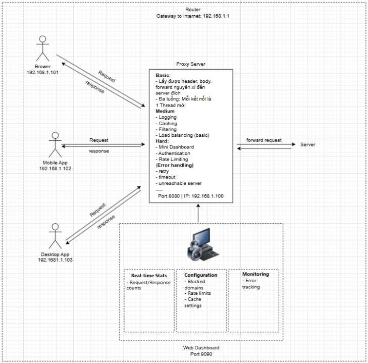

# Forward Proxy Server

## ✨ Introduce

Dự án Forward Proxy Server được xây dựng nhằm mô tả và triển khai một máy chủ proxy đóng vai trò trung gian giữa kết client và server đích. Proxy server tiếp nhận Request từ client, xử lý và chuyển 
tiếp đến Server, sau đó trả lại kết quả cho Client. Hệ thống này cho phép quản lý, giám sát và điều hướng lưu lượng mạng hiệu quả hơn

## 💻 Technology
- Core: Java (17)
- Networking: Socket programming
- Web:
  - HTTPServer 
  - HTML/CSS/JavaScript
  - JSON APIs
- Development tool:
  - Maven
  - IntelliJ IDEA

## 📂 Project Structure

```
network-programming/
├── .idea/
├── com.example/
│   └── src/
│       └── main/
│           └── com.vn/
│               ├── config/
│               ├── constant/
│               ├── dashboard/
│               └── proxy_server/
│                   ├── handler/
│                   └── main/
│               └── util/
│           └── resources/
├── .gitignore
├── README.md
└── com.example.iml
```
Trong đó:
- `config`: Lưu trữ các lớp cấu hình hệ thống, bao gồm lắng nghe, timeout hoặc thông tin server đích
- `constant`: Định nghĩa các hằng số dùng chung trong toàn project (ví dụ: status code, header mặc định,...)
- `dashboard`: Chứa thành phần phục vụ giao diện Dashboard, giúp theo dõi và trực quan hóa hoạt động của Proxy
- `proxy_server`: Thư mục chnh chứa core logic của Forward Proxy(khởi tạo socket, kết nối tới server đích, xử lý request/response,..)
- `proxy_server/handler`: Đảm nhiệm việc xử lý request từ client, quản lý response từ server, phân tách logic xử lý
- `proxy_server/main`: Điêm khởi chạy chương trình, chứa hàm `main` để bootstrapping toàn hệ thống
- `util`: Bao gồm các tiện ích hỗ trợ (logging,...)
- `resources/`: Chứa các tài nguyên tĩnh ảnh, file HTML,CSS,JavaScript

## 🚀 Feature

**Basic**
- Forward request từ client tới Server đích
- Hỗ trợ multi-threading: mỗi request được xử lý trên một luồng riêng

**Medium**
- Logging: ghi lại thông tin request/response
- Caching: Lưu trữ tạm thời response để tăng tốc  độ phản hồi
- Filtering: Lọc nội dung hoặc chặn các request không hợp lệ
- Error Handling: Xử lý và trả về thông tin lỗi một cách rõ ràng

**Hard**
- Mini Dashboard: Giao diện web hiển thị thống kê request, trạng thái hệ thống
- Authentication: Xác thực người dùng khi sử dụng proxy
- Rate Limiting: Giới hạn số lượng request trong một khoảng thời gian nhất định
- Loading Balancing: Phân phối tải khi server có nhiều server đích

## 👨‍💻 Team Members

- Trịnh Quang Lâm
- Cao Thị Thu Hương
- Vũ Nhân Kiên

## 📊 Overall

